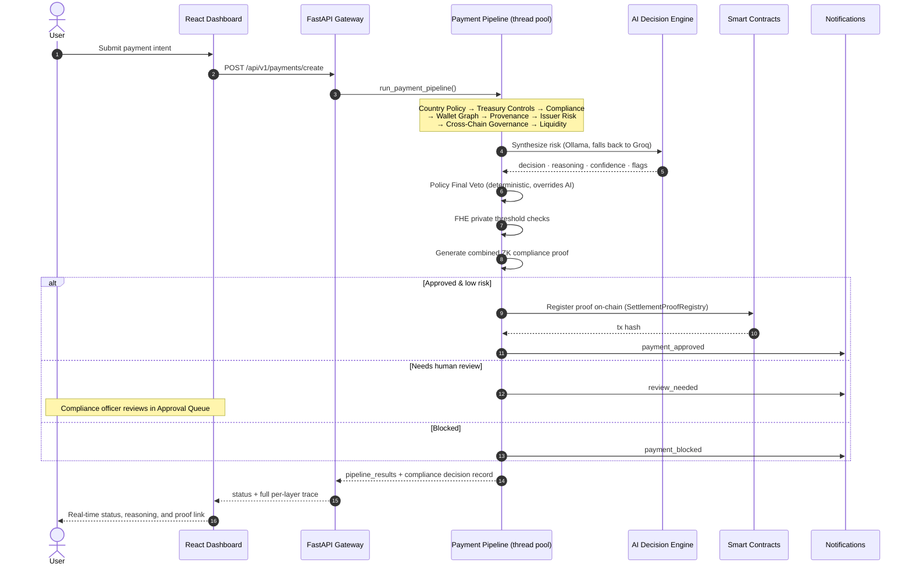

<div align="center">


<a href="#-architecture">
  
</a>

<br/>


<br/><br/>

**[Overview](#-what-is-certapay)** ·
**[Architecture](#-architecture)** ·
**[Pipeline](#-the-24-layer-compliance-pipeline)** ·
**[Features](#-feature-highlights)** ·
**[Tech Stack](#-tech-stack)** ·
**[Getting Started](#-getting-started)** ·
**[API](#-api-reference)** ·
**[Sponsors](#-sponsor--partner-integrations)** ·
**[Status](#-honest-status--known-limitations)**

</div>

<br/>

> [!NOTE]
> This README documents the repository **exactly as it exists** — including what's mocked, what's simulated, and what's genuinely live. No inflated claims. See [Honest Status](#-honest-status--known-limitations) for the receipts.

<br/>

## 🧭 What is CertaPay?

**CertaPay** (repo codename `StableCoinX`) is a full-stack reference implementation of what *institutional-grade* stablecoin settlement infrastructure looks like when compliance isn't bolted on afterward — it's the pipeline itself.

Every payment intent — a corporate treasury moving USDC from Singapore to the UAE, a payroll batch, a cross-border settlement — is pushed through **24 sequential layers** spanning jurisdictional policy, AML/sanctions screening, graph-based wallet forensics, stablecoin issuer risk, LLM-powered advisory reasoning, a deterministic hard-rule veto, privacy-preserving checks, and zero-knowledge proof attestation — **before** a single on-chain transfer is authorized. The result of every decision, and the reasoning behind it, is written to an immutable audit trail and anchored on-chain via a purpose-built proof registry.

It's a hackathon build — and it reads like one that took compliance engineering seriously: fail-safe defaults everywhere (a downed dependency degrades to `manual_review`, never to a silent pass), a real deployed contract suite on Base Sepolia, a live external compliance-mock integration, and a companion Bitcoin CoinJoin classifier that ships its own validation benchmark.

<table>
<tr>
<td width="33%" valign="top">

### 🛡️ Compliance-first
24-stage pipeline: country policy → treasury controls → AML/sanctions → wallet graph → issuer risk → cross-chain governance → AI advisory → deterministic veto.

</td>
<td width="33%" valign="top">

### 🔐 Privacy + Proof
FHE-style encrypted threshold checks and a ZK proof bundle attesting compliance, registered on-chain via a dedicated `SettlementProofRegistry`.

</td>
<td width="33%" valign="top">

### 🕵️ Forensic-grade intel
Neo4j wallet-relationship graphs, a protocol-aware Bitcoin CoinJoin classifier, and an EVM + Tron mixer-signal explorer — each keeping evidence separate from verdicts.

</td>
</tr>
</table>

---

## 🏗️ Architecture

### System overview

```mermaid
flowchart TD
    subgraph CLIENT["🖥️ CLIENT LAYER"]
        FE["React 18 + TypeScript Dashboard<br/>Vite · Tailwind · Radix UI"]
        WALLET["Wallet Connect<br/>wagmi + viem"]
    end

    subgraph EDGE["🔑 EDGE & IDENTITY"]
        AUTH["Supabase Auth<br/>JWT + RBAC"]
        API["FastAPI Gateway<br/>Rate limiting · CORS · Request logging"]
    end

    PI["📥 Payment Intent<br/>sender · receiver · amount · chain · token"]

    subgraph POLICY["🏛️ POLICY & TREASURY"]
        CP["Country Policy Engine"]
        TC["Corporate Treasury Controls"]
    end

    subgraph RISK["🕵️ COMPLIANCE & RISK INTELLIGENCE"]
        CE["Compliance Engine<br/>AML · Sanctions · PEP"]
        WG["Wallet Graph Intelligence<br/>Neo4j"]
        PROV["Provenance & Counterparty Risk"]
        IR["Stablecoin Issuer Risk"]
        OBF["Obfuscation Intelligence<br/>CoinJoin Classifier"]
        MIX["Mixer Signal Explorer<br/>EVM + Tron"]
    end

    subgraph DECIDE["🧠 DECISIONING"]
        CG["Cross-Chain Governance"]
        LQ["Liquidity & Cost Engine"]
        AI["AI Decision Engine<br/>Ollama ⇄ Groq (advisory only)"]
        VETO{{"Policy Final Veto<br/>deterministic, hard rules"}}
    end

    subgraph PRIVACY["🔒 PRIVACY & PROOF"]
        FHE["FHE Private Threshold Checks"]
        ZK["ZK Compliance Proof Generator"]
    end

    DECISION{"Final Status?"}

    subgraph HUMAN["🙋 HUMAN-IN-THE-LOOP"]
        APR["Approval Queue<br/>multi-level review"]
    end

    subgraph CHAIN["⛓️ EXECUTION & SETTLEMENT"]
        EXEC["Execution Orchestrator"]
        SC["Smart Contracts<br/>Base Sepolia · Polygon Amoy"]
        REG["On-chain Proof Registry"]
    end

    subgraph OBS["📡 OBSERVABILITY"]
        NOTIF["Notifications<br/>Telegram · n8n · in-app"]
        AUDIT["Audit Vault"]
        REVAL["Historical Revalidation"]
        MON["Monitoring Dashboard"]
    end

    FE --> AUTH --> API --> PI
    WALLET -.-> PI
    PI --> CP --> TC --> CE
    CE --> WG --> PROV --> IR
    CE -.signals.-> OBF
    CE -.signals.-> MIX
    IR --> CG --> LQ --> AI --> VETO
    VETO --> FHE --> ZK --> DECISION
    DECISION -- "approved" --> EXEC
    DECISION -- "needs review" --> APR --> EXEC
    DECISION -- "blocked" --> NOTIF
    EXEC --> SC --> REG --> NOTIF
    NOTIF --> AUDIT --> REVAL --> MON

    style VETO fill:#7C3AED,color:#fff,stroke:#4C1D95
    style DECISION fill:#0EA5E9,color:#fff,stroke:#075985
    style SC fill:#F59E0B,color:#111,stroke:#92400E
```



### Payment lifecycle, sequence by sequence



---

## 🔢 The 24-Layer Compliance Pipeline

Every settlement traverses all 24 layers sequentially. A failure at any layer halts the pipeline and returns a detailed, per-layer rejection — never a silent pass.

<details>
<summary><b>Expand full layer-by-layer breakdown</b> (click to open)</summary>

| # | Layer | What it does |
|:-:|---|---|
| 1 | 🖥️ **Frontend** | React + TypeScript dashboard for payment initiation, monitoring, and governance controls |
| 2 | 🔑 **Auth** | Supabase JWT authentication with role-based access control |
| 3 | 👛 **Wallet** | Wallet connection, ownership validation, address registry |
| 4 | 📥 **Payment Intent** | Canonical, immutable settlement request representation |
| 5 | 🏛️ **Country Policy** | Jurisdiction-aware corridor rules, sanctioned-country checks, transfer limits |
| 6 | 🏦 **Corporate Treasury Controls** | Daily/monthly limits, multi-sig thresholds, department budgets |
| 7 | 🕵️ **Compliance Engine** | AML screening, sanctions checks (OFAC/EU/UN), PEP detection, KYC/KYB |
| 8 | 🕸️ **Wallet Graph Intelligence** | Neo4j graph analytics — wallet relationships, mixer/tumbler adjacency, cluster risk |
| 9 | 🪙 **Stablecoin Issuer Risk Engine** | Reserve composition, audit history, depeg events, redemption reliability |
| 10 | 🌉 **Cross-Chain Governance** | Bridge risk, destination-chain health, governance-approved chains |
| 11 | 💧 **Liquidity Cost Engine** | Slippage, gas, bridge fees, optimal-route computation |
| 12 | 🤖 **AI Decision Engine** | LLM-powered advisory synthesis (Ollama / Groq) — **never** the final decision-maker |
| 13 | ⚖️ **Policy Final Veto** | Deterministic hard-rule aggregation — pure rule evaluation, zero probabilistic logic |
| 14 | 🔒 **FHE Private Checks** | Compliance thresholds evaluated without exposing raw transaction values |
| 15 | 🧬 **ZK Proof Generator** | Generates a compliance proof bundle for on-chain attestation |
| 16 | 🙋 **Human Approval Workflow** | Manual review queue with multi-level approval chains + Telegram alerts |
| 17 | ⚙️ **Execution Orchestrator** | Sequences on-chain ops: approval, authorization, settlement, retries, gas |
| 18 | 📜 **Smart Contracts** | Solidity contracts for authorization, policy, and settlement |
| 19 | ⛓️ **Blockchain Settlement** | Atomic ERC-20 transfers and cross-chain bridge execution |
| 20 | 🗄️ **On-chain Proof Registry** | Immutable ZK proof + compliance attestation storage |
| 21 | 🔔 **Notifications** | Telegram, in-app, and webhook (n8n) real-time alerts |
| 22 | 🔏 **Audit Vault** | Cryptographically-sealed, immutable audit log |
| 23 | ⏪ **Historical Revalidation** | Retroactively re-scores past settlements against updated rules/sanctions lists |
| 24 | 📊 **Monitoring** | Real-time health, latency, and analytics dashboard |

</details>

---

## ✨ Feature Highlights

<table>
<tr>
<td width="50%" valign="top">

#### 🕵️ Obfuscation Intelligence
Standalone, benchmarked **Bitcoin CoinJoin classifier** (`tools/obfuscation_classifier`) detecting legacy Whirlpool and Wasabi 2.0/WabiSabi structural patterns from public transaction data. Reports *evidence*, never a verdict, and keeps five signals — protocol classification, obfuscation confidence, illicit attribution, provenance confidence, policy recommendation — explicitly separate.

> *"Privacy is not guilt. Uncertainty is not clearance."* — baked into every response.

**Validated:** 33/33 correct on a curated 35-case sample · precision & recall **1.0** *(small seed sample — not a general accuracy claim, see [`VALIDATION_NOTES.md`](tools/obfuscation_classifier/VALIDATION_NOTES.md))*.

</td>
<td width="50%" valign="top">

#### 🌊 Mixer Signal Explorer
Cross-chain mixer-adjacency signals for **EVM chains** (Etherscan-family, requires an API key — honestly reports "unavailable" rather than faking a result without one) and **Tron** (via TronScan's free public API). Surfaced as its own dashboard page, kept as a separate signal from the CoinJoin classifier's output.

</td>
</tr>
<tr>
<td width="50%" valign="top">

#### 🧠 Dual-Provider AI Advisory
LLM synthesis via **Ollama** (local, `gemma:2b`) with automatic fallback to **Groq** (`llama3-8b-8192`). PII (wallet addresses) is redacted before any prompt leaves the process. The AI is explanatory and advisory only — the deterministic **Policy Final Veto** always has the last word.

</td>
<td width="50%" valign="top">

#### 🔒 FHE + ZK Privacy Layer
Encrypted-style threshold checks and a SHA-256-based ZK compliance proof bundle, architected to be swapped for real Groth16/PLONK circuits (`snarkjs` + Circom) without changing the pipeline shape. **Currently a cryptographically-honest simulation** — see [Honest Status](#-honest-status--known-limitations).

</td>
</tr>
<tr>
<td width="50%" valign="top">

#### 🕸️ Wallet Graph Intelligence
Neo4j-backed relationship graphs flag mixer-adjacent clusters and laundering patterns. Fails **closed**: an unreachable Neo4j returns `medium` risk + `neo4j_degraded: true` — never a silent `low`.

</td>
<td width="50%" valign="top">

#### 📜 On-chain Proof Registry
Every settlement's compliance decision, ZK proof hash, AI decision, and policy version is registered on a dedicated `SettlementProofRegistry` contract — independently verifiable on BaseScan.

</td>
</tr>
</table>

---

## 🧩 Product Tour

The frontend ships as a single-page app with role-gated routes:

| Route | Page | Purpose |
|---|---|---|
| `/` | Landing | Public marketing/overview page |
| `/login` | Login | Supabase-backed authentication |
| `/dashboard` | Overview | Live system health, KPIs, scenario runner |
| `/create-payment` | Create Payment | Compose a new payment intent |
| `/payments` | Payments | Full settlement ledger |
| `/route-analysis/:id` | Route Analysis | Engine-by-engine pipeline trace + AI reasoning |
| `/approval-queue` | Approval Queue | Human review for flagged/high-value payments |
| `/policies` | Policies | Country + corporate policy rules |
| `/compliance` | Compliance | AML/sanctions/PEP results, counterparty & provenance cards |
| `/obfuscation-intelligence` | Obfuscation Intelligence | CoinJoin classifier UI |
| `/mixer-signals` | Mixer Signal Explorer | EVM/Tron mixer-adjacency lookup |
| `/audit-reports` | Audit Reports | Sealed audit log + PDF report generation |
| `/revalidation` | Revalidation | Retroactive re-scoring against updated rules |
| `/integrations` | Integrations | Live provider status (Beeceptor, Neo4j, chains) |
| `/infrastructure` | Infrastructure | Dependency health |
| `/proof/:paymentId` | Proof Page | Public-facing settlement verification |
| `/settings` | Settings | User + AI-engine preferences |

---

## 🛠️ Tech Stack

<div align="center">

**Frontend**


**Backend**


**Data & Infra**


**Blockchain**


**AI & Privacy**


**Messaging, Ops & Sponsor Integrations**


</div>

---

## 📁 Repository Structure

```text
stablecoinx/
├── backend/                       # FastAPI service (≈14k LOC)
│   ├── app/
│   │   ├── api/v1/endpoints/      # 17 route modules (auth, payments, ai, privacy, …)
│   │   ├── core/                  # Settings, security, blockchain config, rate limiting
│   │   ├── db/                    # SQLAlchemy engine, Redis client, demo seed script
│   │   ├── middleware/            # Rate limiter + request logger
│   │   ├── models/                # ORM models (payments, decisions, audits, teams…)
│   │   ├── schemas/                # Pydantic request/response schemas
│   │   └── services/
│   │       ├── ai/                 # Ollama/Groq decision engine + health checks
│   │       ├── blockchain/         # Contract service, execution orchestrator, RPC, wallet
│   │       ├── compliance/         # AML engine, wallet graph, provenance, issuer risk
│   │       ├── governance/         # Country policy, treasury controls, chain governance
│   │       ├── mixer_signals/      # EVM + Tron mixer-adjacency providers
│   │       ├── notifications/      # Telegram, n8n, alert dispatch
│   │       ├── obfuscation/        # Product layer over the CoinJoin classifier
│   │       ├── privacy/            # FHE + ZK proof services
│   │       ├── reports/            # PDF report generation (ReportLab)
│   │       ├── revalidation/       # Historical re-scoring engine
│   │       └── payment_pipeline.py # 🎯 the master orchestrator
│   └── tests/                     # 13 pytest suites
├── contracts/                      # Foundry project (≈480 LOC Solidity)
│   ├── src/                        # PaymentAuthorization, PolicyRegistry, SettlementProofRegistry, MockStablecoinERC20
│   ├── test/                       # 4 Foundry test suites
│   ├── script/                     # Deploy.s.sol
│   └── broadcast/                  # Real Base Sepolia deployment receipts
├── frontend/                       # React + Vite SPA (≈5.8k LOC)
│   └── src/{pages,components,store,lib,hooks}
├── tools/obfuscation_classifier/   # Standalone, independently-runnable CoinJoin classifier
├── docs/                           # Architecture, sponsor integrations, hackathon baseline, demo script
├── scripts/                        # start_demo.sh, reset_demo.sh, connectivity/balance checks
└── render.yaml                     # Render Blueprint (infra-as-code)
```

---

## 🚀 Getting Started

### Prerequisites

- **Python** 3.11+
- **Node.js** 18+
- **Foundry** (`forge`) — for contracts
- Optional, all degrade gracefully if absent: **PostgreSQL**, **Redis**, **Neo4j**, **Ollama**

### ⚡ Fastest path — demo scripts

```bash
git clone <repo-url> && cd stablecoinx
export APP_ENV=demo
cp .env.example .env   # fill in what you have; everything else degrades gracefully
./scripts/start_demo.sh    # boots Ollama/Redis if available, migrates, seeds, launches both apps
```

```bash
./scripts/reset_demo.sh    # wipes payments/decisions/alerts and reseeds
```

### 🔧 Manual setup

<table>
<tr><th>Backend</th><th>Frontend</th><th>Contracts</th></tr>
<tr valign="top">
<td>

```bash
cd backend
python -m venv .venv
source .venv/bin/activate
pip install -r requirements.txt
cp ../.env.example ../.env
uvicorn app.main:app --reload --port 8000
```

</td>
<td>

```bash
cd frontend
npm install
npm run dev
```

</td>
<td>

```bash
cd contracts
forge install
forge build
forge test
```

</td>
</tr>
</table>

Backend → **http://localhost:8000** (Swagger UI at `/docs`) · Frontend → **http://localhost:5173**

### 🔑 Seeded demo accounts

On boot (`APP_ENV=demo` or `development`), five demo users are seeded automatically:

| Role | Email | Password |
|---|---|---|
| Admin | `admin@settleguard.com` | `hackathon123` |
| Treasury Officer | `treasury@settleguard.com` | `hackathon123` |
| Compliance Officer | `compliance@settleguard.com` | `hackathon123` |
| Reviewer | `reviewer@settleguard.com` | `hackathon123` |
| Auditor | `auditor@settleguard.com` | `hackathon123` |

---

## ⛓️ Deployed Contracts

Real Foundry deployment receipts, live in `contracts/broadcast/Deploy.s.sol/84532/`, verifiable on BaseScan:

| Contract | Address (Base Sepolia) |
|---|---|
| `MockUSDC` | [`0x6c2013c85a1a5a93d4315314072a1516cbb99606`](https://sepolia.basescan.org/address/0x6c2013c85a1a5a93d4315314072a1516cbb99606) |
| `MockUSDT` | [`0x4adcbba815714ae364c2a8b76bc029c3be9a2681`](https://sepolia.basescan.org/address/0x4adcbba815714ae364c2a8b76bc029c3be9a2681) |
| `PaymentAuthorization` | [`0x3e6cc45bc110e6ac3646e4c346b736873d04fe24`](https://sepolia.basescan.org/address/0x3e6cc45bc110e6ac3646e4c346b736873d04fe24) |
| `SettlementProofRegistry` | [`0xbb44db85c5dfc860c7e94f447a19959c57ebac45`](https://sepolia.basescan.org/address/0xbb44db85c5dfc860c7e94f447a19959c57ebac45) |
| `PolicyRegistry` | [`0x19b7cbc3320e153df3a9959dae32c661d06de22d`](https://sepolia.basescan.org/address/0x19b7cbc3320e153df3a9959dae32c661d06de22d) |

> Deployed from `contracts/script/Deploy.s.sol`. Point `.env`'s `CONTRACT_ADDRESS_*` vars at these (or your own deployment) to enable on-chain execution.

---

## 📡 API Reference

Interactive Swagger docs live at `/docs` once the backend is running. Router summary:

| Prefix | Router | Highlights |
|---|---|---|
| `/api/v1/auth` | `auth` | register, login, roles, `/me`, AI-engine preference |
| `/api/v1/payments` | `payments` | create, list, pending, per-payment pipeline trace |
| `/api/v1/decisions` | `decisions` | compliance decision record per payment |
| `/api/v1/approvals` | `approvals` | human review queue |
| `/api/v1/audit` | `audit` | audit vault + PDF report generation |
| `/api/v1/policy` & `/policy-engine` | `policy*` | country rules, per-team policy CRUD + evaluation |
| `/api/v1/revalidation` | `revalidation` | trigger sanctions/policy/wallet/issuer re-scoring |
| `/api/v1/execution` | `execution` | execute, status, on-chain audit trail |
| `/api/v1/wallet` | `wallet` | connect, balance, network status, faucet |
| `/api/v1/ai` | `ai` | AI health, analyze, decision lookup |
| `/api/v1/privacy` | `privacy` | FHE checks, ZK proof generation + verification |
| `/api/v1/monitoring` | `monitoring` | stats, AI performance, route efficiency |
| `/api/v1/obfuscation` | `obfuscation` | CoinJoin analysis, demo txids, validation snapshot |
| `/api/v1/mixer-signals` | `mixer_signals` | EVM/Tron mixer-adjacency lookup |
| `/health`, `/api/v1/health` | — | liveness + DB/Redis dependency probes |

---

## ⚙️ Environment Variables

Full reference in [`.env.example`](.env.example). Backend startup (`Settings.validate_config()`) hard-requires:

```
DATABASE_URL · REDIS_URL · JWT_SECRET_KEY (≥32 chars) · OLLAMA_BASE_URL · OLLAMA_MODEL
GROQ_MODEL · NEO4J_URI · NEO4J_USER · NEO4J_PASSWORD · TELEGRAM_BOT_TOKEN · TELEGRAM_CHAT_ID
CONTRACT_ABI_PATH · BASE_SEPOLIA_CHAIN_ID · BASE_SEPOLIA_RPC_URL · APP_ENV
```

Everything else (Supabase keys, Groq API key, the settlement wallet private key, all four contract addresses) is optional at boot — every downstream feature degrades gracefully per-request instead of crashing startup.

---

## 🤝 Sponsor & Partner Integrations

| Integration | Status | What's real |
|---|:-:|---|
| **Beeceptor** | 🟢 Live | External compliance + wallet-risk + Bitcoin attribution mock, **58 configured rules**. Any timeout/5xx/malformed response → `provider_status: degraded` → automatic route to manual review, verified end-to-end against the real endpoint (not mocked in tests) |
| **n8n** | 🟢 Live (local) | Real webhook workflow (`Webhook → Code → Send Email → Respond`) turning `payment.blocked` / `manual_review_required` / `settlement.executed` events into emails, verified via live IMAP fetch against a disposable Ethereal SMTP mailbox |
| **Render** | 🟡 Infra-as-code only | Full `render.yaml` Blueprint (backend + static frontend + managed Postgres + optional Redis) — validated YAML, **never deployed against a live account** |
| **Trace Commons** | ⚪ Not started | Requires capturing real agent work sessions — not a code change |
| **.xyz** | ⚪ Not started | DNS/domain wiring pending a registered domain |
| **CodeCrafters** | ⚪ Not started | Lowest priority; dev-only test-infra value |

Full write-up with request/response contracts: [`docs/SPONSOR_INTEGRATIONS.md`](docs/SPONSOR_INTEGRATIONS.md).

---

## 🧪 Honest Status & Known Limitations

Nothing below is hidden — it's all documented in-repo, and this README just surfaces it up front.

<table>
<tr><td>

**✅ Confirmed working**
- Backend boots, seeds, and serves the full API (SQLite fallback if Postgres is absent)
- Frontend `npm run build` succeeds end-to-end
- Full payment pipeline runs, produces per-layer trace, persists a decision record
- Real contracts deployed & verified on Base Sepolia (see above)
- Beeceptor + n8n integrations verified against live endpoints, not just unit tests
- Obfuscation classifier: 33/33 correct on its curated validation set

</td><td>

**⚠️ Degrades / simulated by design**
- **ZK proofs** are a deterministic SHA-256 proof *structure* — architected for real Groth16/PLONK circuits, not yet wired to `snarkjs`
- **FHE checks** are in-process simulations of encrypted-threshold evaluation
- Without Postgres/Redis/Neo4j/Ollama running, each dependency **fails closed** (e.g. wallet risk → `medium` not `low`) rather than crashing
- Render blueprint is untested beyond YAML validity — no live deploy yet

</td></tr>
</table>

**Test suites** (see [`docs/HACKATHON_BASELINE.md`](docs/HACKATHON_BASELINE.md) for the full breakdown of every failing test and why):

| Suite | Result |
|---|---|
| Backend (`pytest`, 13 files) | **42 passed / 6 failed** — remaining failures are pre-existing test-seam mismatches (e.g. tests `await`-ing a sync function), not silent product bugs |
| Contracts (`forge test`) | **12 passed / 0 failed**, 4 suites |
| Frontend (`npm run build`) | **Succeeds** — warnings only (chunk size, Rollup PURE-comment noise) |

---

## 🗺️ Roadmap

- [ ] Wire real Groth16/PLONK circuits (Circom + snarkjs) behind the existing ZK service interface
- [ ] Live Render deployment with managed Postgres + external Neo4j (Aura)
- [ ] Close out the 6 pre-existing backend test-seam failures
- [ ] Trace Commons, `.xyz`, and CodeCrafters sponsor tracks
- [ ] Dual-approval orchestration driven through n8n (currently notification-only)

---

## 📄 License

MIT. *(No `LICENSE` file is committed yet — add one, e.g. via GitHub's license picker, to make it official.)*

<div align="center">
<br/>

*Built in a hackathon. Documented like it wasn't.*


</div>
